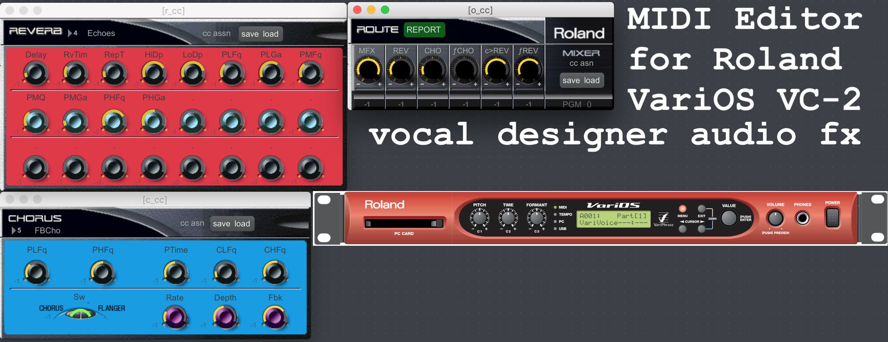

# Varios-VC2FX
MIDI editor bridge for Roland VariOS VC2 Vocal Designer

The Roland VariOS VC2 Vocal Designer has many characterful effects that unfortunately are only editable by front-panel controls or by Midi System Exclusive (MIDI SYSEX) messages. This is a problem!

This .maxpat for Cycling74 MaxMSP acts as an editor and 'bridge', translating from MIDI CC to MIDI SYSEX. Editing and sequencing become a joyful experience. No problem!

Easily apply DAW 'automation curves' to the effect parameters of the VC2 hardware (e.g. a swell of reverb, a variable chorus LFO rate). The complete state of the VC2 hardware can be requested and stored as .SYX MIDI SYSEX data files, saved side-by-side with DAW project files.

## Cycling 74 MaxMSP

The provided .maxpat file is compatible with and requires Cycling74 MaxMSP. It was made with and tested extensively with version 7.3.5 which supports the 32-bit intel machines that I use in my studio workspace. The .maxpat depends on Peter Elsea's L-objects `Lsx, Lhex, Lchunk, and Label` as `.mxo` files.

## MIDI System Exclusive

The software can transmit data packets to configure the VariOS hardware, a number of datapackets are provided as binary files in the `syx` folder. When the VariOS hardware receives the data in these files, it is preset to apply a specific chorus/reverb/multi-fx process to the input audio.

## MIDI Control Change ccS ccL

Inelegantly but helpfully the .maxpat can configure, save, and load assignments of Midi Control Change (MIDI CC) messages to specific parameter dials. Use the small number boxes next to the dials to specify the MIDI CC number (0..127, -1 means ignored). Save and load assignments using the `ccS` and  `ccL` buttons.

## Hardware clobbering

Disable (barely visible checkmark shadow) transmission of messages before selecting a specific effect type (e.g. select CHORUS 3, or CATHEDRAL reverb) to **avoid clobbering the hardware** when you wish to simply set the dial labels and min-max ranges.

Enable (to display a bright clear checkmark) transmission of messages when you wish to **clobber the hardware** with a new state with default parameter values.

## Abbreviations and caveats

Parameter labels are abbreviated heavily. Some particularly cryptic labels are explained below.

- `M>` signal from main input to effect processor blocks. Turn this up to hear sound.
- `ƒR` signal from reverb processor to main output.
- `ƒC` signal from chorus processor to main output.
- `c>R` lsignal from chorus processor chained to reverb processor input.

Contact me and I'll correct any incorrect parameter ranges and labels.  Roland documentation includes only display ranges (as opposed to the dial ranges), soo all of this has been reverse engineered.
